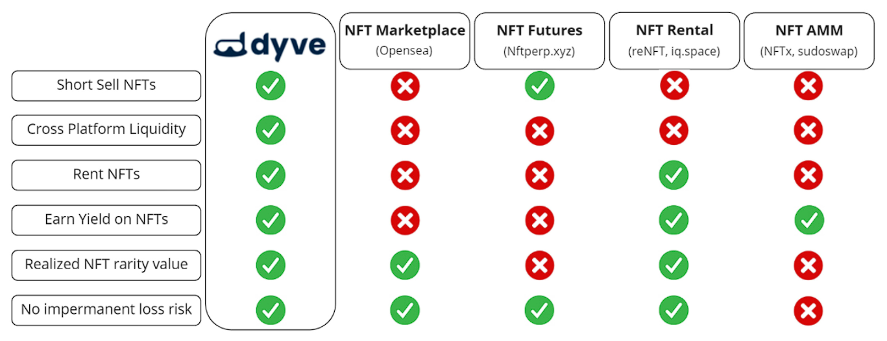

# Dyve
An NFT platform that allows users to short NFTs

## Manifesto
To be the backbone of a capital efficient NFT ecosystem for digital and real world private assets

## Problem
NFT markets are broken. Billions of NFTs are being traded with limited tooling and millions are sitting idly, resulting in them being unproductive.

This leads to the current status quo of limited trading strategies and capital inefficient NFT markets

## Solution
Market infrastructure to short NFTs. By introducing an infrastructure that creates a borrower and lender interaction for shorting NFTs, this allows the NFTs in the ecosystem to become more capital efficient

## Product Overview

## Progress
A functional POC prototype exists with the timeline of a testnet launch by the end of August and a mainnet launch by EOY.

After numerous feedback from the POC demo, it has revealed a number of potential improvements and feature requests such as:
- **Automated Selling of NFT on the Open Market**: Instead of putting the responsibility of selling the NFT on the open market on the Borrower, the Dyve platform would automate that task and transfer the amount sold to the Borrower
- **Alternative Collateral Currencies**: Instead of just allowing ERC720 currencies to be used as collateral, using other ERC721 NFTs from other collections to be used as collateral instead
- **NFT rental system**: Introduce the functionality to allow users to borrow the NFT for a specified timeframe for a small fee to the Lender

All of these features are currently in development and are expected to be released in the version of the product

## Differentiation
Dyve is the first platform that allows users to Short Sell NFTs with Cross Platform Liquidity, which allows allows lenders to earn yield on their NFTs with no risk of impermanent loss

## Team
**[Neil Duchen](https://www.linkedin.com/in/neil-duchen/)** - Founder & CEO
- 10+ years in capital markets, led teams of 15+ in multi-million dollar project deliveries
- 1.5 years Web3/DeFi/NFT research, leading strategy and operations teams
- Former ASA/CERA (Society of Actuaries)
- COO of WolvesDAO (GameDi/NFTs research community)

**[Jesper Kristensen](https://www.linkedin.com/in/jespertoftkristensen/)** - Technical Advisor - part-time [Full Stack Developer](https://jesperkristensen58.github.io/)
- Panoptic founding team ($4M+ seed round, decentralized options protocol)
- DeFi solidity developer & blockchain engineer
- Ph.D. from Cornell University in applied and engineering physics

**[Stanley Szeto](https://www.linkedin.com/in/gwszeto/)** - First Engineer
- 5+ years of professional development
- MedMe (YC W21) Founding Engineer
- Desgined and built Canada's largest COVID-19 vaccine booking platform

## Grant Request
10K & the community's help

## Funds
The POC for Dyve has won multiple hackathons awards. The requested funding will be contributed towards the feature requests and improvements mentioned in **Progress** section along with the technical roadmap laid out here
"Insert Technical Roadmap here"

## Additional Resources
- Dyve Landing Page
- Twitter
- Discord Server

asd
